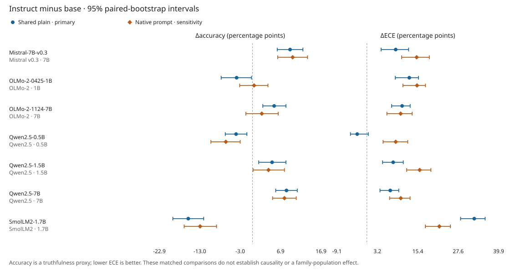

# AlignmentTax

I compare truthfulness and confidence calibration in matched base/instruct checkpoints on a binary derivative of [TruthfulQA](https://github.com/sylinrl/TruthfulQA).

Does instruction tuning consistently trade calibration for truthfulness?

I score leading-space A/B label likelihoods with [scoring.py](src/alignmenttax/scoring.py), compare paired questions with [cross_family.py](src/alignmenttax/cross_family.py), and run the pinned checkpoints on one L4 with [modal_app.py](modal_app.py).

**Calibration usually worsens, but not consistently in exchange for better truthfulness.** With shared plain prompts, four of seven pairs gain accuracy and increase expected calibration error (ECE); two lose accuracy and worsen ECE. Qwen2.5-0.5B loses accuracy, with an uncertain ECE change. These are task-specific checkpoint comparisons, not a causal effect of reinforcement learning.

## Cross-family result

I completed all [22,120 score rows](results/cross_family/analysis/environment.json) across seven pairs, two protocols and [790 questions](results/cross_family/analysis/summary.json), including the previously blocked pinned 0.5B pair. My [analysis plan was committed before scoring](https://github.com/mottopanikeiku/alignmenttax/commit/e299861).

Shared-prompt results below are instruct minus base. Brackets are 95% paired-bootstrap intervals from 10,000 question resamples. Accuracy columns are percentages; deltas are percentage points. Positive ΔECE is worse. [Full table and intervals](results/cross_family/analysis/summary.csv):

| Pair | Base accuracy | Instruct accuracy | Δaccuracy [95% CI] | ΔECE [95% CI] |
|---|---:|---:|---:|---:|
| [Qwen2.5-0.5B](results/cross_family/qwen2_5_0_5b) | 50.51 | 46.46 | -4.05 [-6.71, -1.39] | -2.93 [-4.98, +0.42] |
| [Qwen2.5-1.5B](results/cross_family/qwen2_5_1_5b) | 53.92 | 58.73 | +4.81 [+1.52, +8.23] | +7.96 [+4.75, +11.02] |
| [Qwen2.5-7B](results/cross_family/qwen2_5_7b) | 69.49 | 77.85 | +8.35 [+5.70, +11.01] | +7.07 [+3.97, +9.65] |
| [OLMo-2-0425-1B](results/cross_family/olmo2_0425_1b) | 49.87 | 45.95 | -3.92 [-7.72, -0.25] | +12.84 [+8.60, +15.62] |
| [OLMo-2-1124-7B](results/cross_family/olmo2_1124_7b) | 63.04 | 68.35 | +5.32 [+2.53, +8.23] | +10.66 [+7.49, +13.10] |
| [SmolLM2-1.7B](results/cross_family/smollm2_1_7b) | 54.43 | 38.61 | -15.82 [-19.62, -12.03] | +32.50 [+28.36, +35.80] |
| [Mistral-7B-v0.3](results/cross_family/mistral_7b_v0_3) | 66.58 | 75.82 | +9.24 [+6.08, +12.41] | +8.72 [+4.30, +12.63] |



The larger Qwen and OLMo checkpoints show a tradeoff here, while their smallest measured counterparts do not gain accuracy. SmolLM2-1.7B loses accuracy under both protocols. With native chat templates, ECE increases for all seven pairs, but only three have an accuracy interval above zero. The OLMo-2-7B accuracy gain becomes uncertain. Native results also change the instruct prompt, so they are not a weights-only comparison.

The metric matters: Qwen2.5-7B's Brier score improves while its ECE and NLL worsen. Brier and NLL mix calibration with discrimination; I report [all six metrics](results/cross_family/analysis/summary.json), not just the ones that favor a tradeoff.

For the 0.5B instruct model, [held-out temperature scaling](results/cross_family/qwen2_5_0_5b/calibration/stage2_temperature_calibration_summary.csv) lowers test ECE from 25.30% to 6.52%, with accuracy unchanged at 46.53%. The fitted temperature reaches the upper bound of 200: confidence moves toward chance, not better answers. This supplementary check is not the cross-family comparison.

## Reproduce

My [conservative cloud-cost estimate is **at most $1.06**](results/cross_family/cost.json), including failed pilots, within a $2.50 budget. It includes startup, downloads, CPU/memory and a ten-percent allowance; it is not an invoice. Scoring used bf16 weights, one L4, two CPU cores and 16 GiB host memory. Model/tokenizer commits are [pinned](configs/cross_family.json); weights are downloaded only in the cloud.

With a Modal account already authenticated:

```sh
uv sync
ALIGNMENTTAX_MINUTES=90 uv run --with modal==1.5.3 modal run modal_app.py
nice -n 19 uv run python -m alignmenttax.cross_family --root results/cross_family --out results/cross_family/analysis
```

Skip the second command to rebuild the table and SVG from committed scores without GPU costs. Full scores are losslessly gzipped JSONL. The [protocol](docs/PROTOCOL.md) covers scalar execution, the failed batching pilot, and held-out calibration. The [old interrupted CPU attempt](results/qwen2_5_0_5b) is retained separately, not mixed into these scores.

## Limitations

- Best Answer versus Best Incorrect Answer is not official TruthfulQA MC1/MC2 or free-form generation.
- Confidence is normalized over ` A` and ` B`, not verbal confidence or all possible answers. Other label continuations were not tested.
- Base/instruct changes include different post-training stages and data. Native templates add a prompt change. Neither comparison isolates RL causally.
- These selected checkpoints and one task are not a model-family population. Intervals are pointwise and resample questions, not training seeds. ECE depends on binning; nominal size comparisons also confound training data and releases.
- I use scalar bf16 inference after the [batch pilot exceeded its tolerance](results/pilot/batch_parity_failure.json). No precision sweep was run; temperature scaling covers one split of the 0.5B pair only.

## Prior work

TruthfulQA is by [Lin, Hilton and Evans](https://arxiv.org/abs/2109.07958); its redistributed text retains the [Apache license and attribution](results/NOTICE.txt). I build on [Kadavath et al.](https://arxiv.org/abs/2207.05221) and [Guo et al.](https://arxiv.org/abs/1706.04599) for probability calibration and temperature scaling. [Huang, Lu and Zeng](https://arxiv.org/abs/2508.00264) already study post-training calibration on MMLU; my comparison uses a different task and paired intervals. Models come from [Qwen](https://huggingface.co/Qwen), [Allen AI](https://huggingface.co/allenai), [Hugging Face](https://huggingface.co/HuggingFaceTB) and [Mistral](https://huggingface.co/mistralai).

Written with AI coding assistance.
