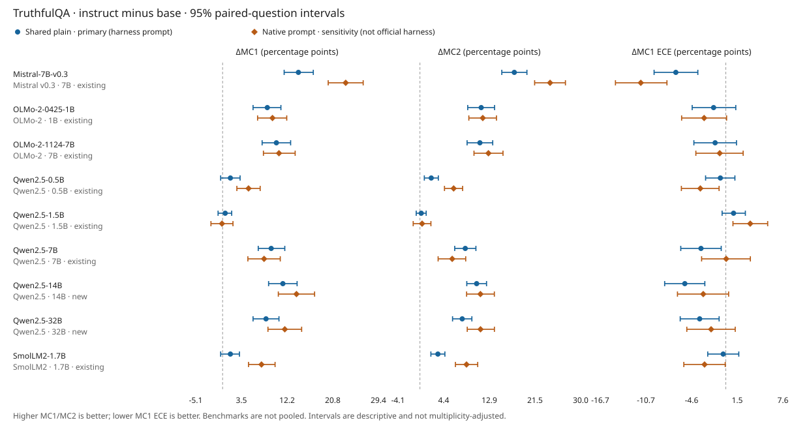

# AlignmentTax

**I find opposite calibration changes under two TruthfulQA scoring definitions.** With shared prompts, six of nine binary comparisons gain accuracy but worsen ECE. On standard MC1, four improve both and none show that resolved tradeoff. These are checkpoint comparisons, not a causal effect of reinforcement learning.

I completed nine pinned base/instruct pairs across Qwen2.5 (0.5/1.5/7/14/32B), OLMo-2 (1/7B), SmolLM2 (1.7B) and Mistral (7B). The [plan was committed before scoring](https://github.com/mottopanikeiku/alignmenttax/commit/457f8c2). I retain **29,412 standard rows and 28,440 binary rows** under shared and native protocols; base-native rows reuse unchanged shared prompts. [Counts, raw sources and every metric](results/day_scale/analysis/summary.json).

## Standard TruthfulQA result

I use all 817 questions and the [pinned lm-evaluation-harness definitions](https://github.com/EleutherAI/lm-evaluation-harness/tree/d6de81643928d653435c431bae19945d41d32520/lm_eval/tasks/truthfulqa): the exact six-example Q/A primer, space-delimited full answers and summed token log likelihoods without length normalization. MC1 is best-answer accuracy; MC2 is probability mass assigned to true answers, **not hard accuracy**. MC1 confidence is normalized over its candidate answers.

Instruct minus base, in percentage points. Brackets are pointwise 95% paired-bootstrap intervals from 10,000 question resamples; positive ΔECE is worse. Counts require both marginal intervals to exclude zero, not a joint significance test. [Full table](results/day_scale/analysis/summary.csv):

| Pair | ΔMC1 [95% CI] | ΔMC2 [95% CI] | ΔMC1 ECE [95% CI] |
|---|---:|---:|---:|
| [Mistral-7B-v0.3](results/day_scale/mistral_7b_v0_3) | +14.32 [+11.63, +17.14] | +17.60 [+15.27, +19.95] | -6.66 [-9.56, -3.73] |
| [OLMo-2-1B](results/day_scale/olmo2_0425_1b) | +8.45 [+5.75, +11.02] | +11.43 [+8.91, +13.92] | -1.63 [-4.48, +1.33] |
| [OLMo-2-7B](results/day_scale/olmo2_1124_7b) | +10.16 [+7.47, +12.85] | +11.18 [+8.79, +13.57] | -1.43 [-4.26, +1.42] |
| [Qwen2.5-0.5B](results/day_scale/qwen2_5_0_5b) | +1.47 [-0.37, +3.30] | +2.11 [+0.82, +3.43] | -0.73 [-2.69, +1.21] |
| [Qwen2.5-1.5B](results/day_scale/qwen2_5_1_5b) | +0.49 [-0.86, +1.72] | +0.24 [-0.70, +1.16] | +1.03 [-0.49, +2.61] |
| [Qwen2.5-7B](results/day_scale/qwen2_5_7b) | +9.18 [+6.73, +11.75] | +8.45 [+6.48, +10.44] | -3.31 [-6.00, -0.61] |
| [Qwen2.5-14B](results/day_scale/qwen2_5_14b) | +11.38 [+8.69, +14.08] | +10.57 [+8.74, +12.42] | -5.47 [-8.15, -2.80] |
| [Qwen2.5-32B](results/day_scale/qwen2_5_32b) | +8.20 [+5.75, +10.65] | +7.89 [+6.08, +9.69] | -3.48 [-6.08, -0.89] |
| [SmolLM2-1.7B](results/day_scale/smollm2_1_7b) | +1.47 [-0.37, +3.18] | +3.35 [+2.04, +4.65] | -0.35 [-2.41, +1.73] |



Qwen14B MC1 rises from **40.02% to 51.41%**; Qwen32B rises from **40.27% to 48.47%**. Their shared-prompt ECE decreases by 5.47 and 3.48 points. In the [790-question A/B-label derivative](docs/PROTOCOL.md), the same pairs instead increase ECE by **10.15 [6.27, 11.58]** and **7.14 [3.40, 9.09]** points. That is a disagreement between measurements, not proof that answer format alone causes the reversal.

Native prompts wrap the same entire harness prompt in the instruct chat template. They are sensitivity results, not the official harness default: three standard pairs improve both MC1 and ECE; six comparisons remain uncertain. The binary sensitivity has five accuracy/ECE tradeoffs. ECE and proper scores also disagree: Qwen7's standard ECE and Brier improve while NLL worsens. I report all metrics rather than select one favorable story.

## Reproduce

Rebuild the analysis without models:

```sh
uv sync
uv run python -m alignmenttax.scale_analysis --root results/day_scale --out results/day_scale/analysis --old-binary-root results/cross_family
```

For model runs, [the cloud runner](tools/day_modal_app.py) provides `::download` on CPU before offline `::score`; select pairs with `--pairs`, set `ALIGNMENTTAX_GPU=L4` for ≤7B or `H100` for 14/32B, and use Python 3.13 with Modal 1.5.3. Completed checkpoint units resume from the Volume. `::cleanup` removes weights while keeping data/results. [Pins and full methods](configs/day_scale.json), [execution plan](docs/DAY_SCALE_PLAN.md), [dataset/license attribution](results/NOTICE.txt).

My [conservative compute estimate is $6.12](results/day_scale/cost.json), including earlier binary work, failed runs, CPU/memory and a ten-percent allowance; it is not an invoice and excludes storage/network charges. Inference uses BF16 without quantization or CPU offload. I [deleted the weight cache](results/day_scale/cache_cleanup.json).

## Limits

- These are restricted-choice probabilities, not generated-answer or verbal confidence. The 817-question standard task and 790-question derivative are never pooled; their Brier definitions differ.
- Native prompting and post-training data/objectives are confounders. Standard runs use H100/L4; OLMo7 uses an H100 base and L4 instruct. Hardware and precision variability are not in the intervals.
- These fixed checkpoints are not a family population. Intervals resample questions, not training seeds, and have no multiplicity correction; ECE depends on binning.
- [21 of 27 cache audits failed](results/day_scale/numerical_audit.json), so those conditions use scalar full forwards with unchanged thresholds. Audits cover only four fixed questions per condition, not every question; no precision sweep was run.

TruthfulQA is by [Lin, Hilton and Evans](https://arxiv.org/abs/2109.07958). Calibration/post-training precedents include [Guo et al.](https://arxiv.org/abs/1706.04599), [Kadavath et al.](https://arxiv.org/abs/2207.05221) and [Huang, Lu and Zeng](https://arxiv.org/abs/2508.00264). [Earlier temperature-scaling results](results/cross_family/qwen2_5_0_5b/calibration) remain a separate supplement.

Written with AI coding assistance.
